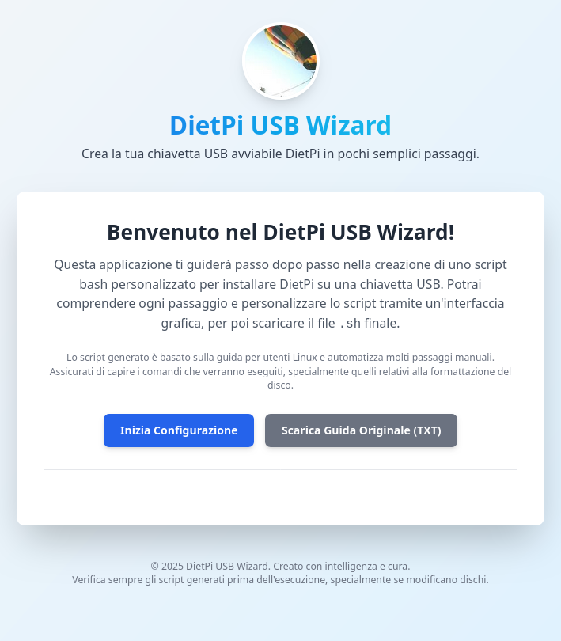

# 🚀 DietPi USB Wizard - Generatore di Script per Chiavette USB Avviabili


> Progetto su [GoogleAIstudio](https://aistudio.google.com/apps/drive/1_vOlHAlPUq9mWoRIcrajcgDvJJ6fifK-?showAssistant=true&showCode=true&showFileTree=true&showTreeView=true&showPreview=true)

## 🌟 Introduzione

Benvenuto nel **DietPi USB Wizard**! Questa applicazione web React ti guida passo-passo nella creazione di uno script Bash personalizzato per installare **DietPi** su una chiavetta USB. L'obiettivo è semplificare il processo, rendendolo comprensibile e personalizzabile, per poi fornirti un file `.sh` pronto all'uso.

Lo script generato si basa su una guida dettagliata per utenti Linux e automatizza molti passaggi manuali, inclusi:
- Scaricamento dell'immagine DietPi
- Scrittura sul dispositivo USB
- Configurazione iniziale (hostname, rete, timezone)
- Messaggio di benvenuto personalizzato

**ATTENZIONE:** È fondamentale comprendere i comandi che verranno eseguiti dallo script, specialmente quelli relativi alla formattazione del disco, per evitare perdite di dati.

## ✨ Caratteristiche Principali

- **Interfaccia Guidata Intuitiva**: Wizard a passi con progress indicator
- **Personalizzazione Avanzata**:
  - URL immagine DietPi personalizzabile
  - Selezione dispositivo USB con controlli di sicurezza
  - Configurazione hostname e rete (Ethernet/Wi-Fi)
- **Generazione Script Sicuro**: 
  - Multipli controlli di validazione
  - Avvisi espliciti per passaggi critici
- **Download Diretto**:
  - Script bash pronto all'uso
  - Opzione per scaricare la guida originale
- **Responsive Design**: Accessibile da desktop e mobile

## 🛠️ Struttura Tecnica del Progetto

Ecco la struttura del progetto aggiornata e formattata nello stile richiesto:

```
📦 dietpi-usb-wizard
├── 📂 assets
│   └── 🖼️ screenshot.png
├── 📂 components
│   └── 📄 StepIndicator.tsx
├── 📂 services
│   └── 📄 scriptBuilder.ts
├── 📄 .gitignore
├── 📄 App.tsx
├── 📄 constants.ts
├── 📄 env.example
├── 📄 index.html
├── 📄 index.tsx
├── 📄 LICENSE
├── 📄 metadata.json
├── 📄 package.json
├── 📄 README.md
├── 📄 tsconfig.json
├── 📄 types.ts
└── 📄 vite.config.ts
```

### Descrizione della Struttura:

1. **📂 assets** - Contiene risorse statiche
   - `screenshot.png`: Anteprima dell'applicazione

2. **📂 components** - Componenti React
   - `StepIndicator.tsx`: Indicatore visivo dei passaggi del wizard

3. **📂 services** - Logica di business
   - `scriptBuilder.ts`: Generatore dello script bash

4. **File principali**:
   - `App.tsx`: Componente root dell'applicazione
   - `index.html`: Template HTML principale
   - `index.tsx`: Punto di ingresso

5. **Configurazione**:
   - `vite.config.ts`: Configurazione di Vite
   - `tsconfig.json`: Configurazione TypeScript
   - `package.json`: Dipendenze e script NPM

6. **Altri file importanti**:
   - `constants.ts`: Testi e costanti
   - `types.ts`: Definizioni TypeScript
   - `env.example`: Template variabili d'ambiente
   - `LICENSE`: Licenza MIT
   - `README.md`: Documentazione principale

La struttura mantiene una gerarchia chiara e coerente con le migliori pratiche per progetti React + TypeScript, evidenziando sia i componenti UI che la logica di servizio separatamente.

### Componenti Chiave

- **`App.tsx`**: Gestisce lo stato dell'applicazione e la logica del wizard
- **`scriptBuilder.ts`**: Genera lo script bash con:
  - Controlli di sicurezza
  - Gestione errori
  - Configurazione personalizzata
- **`StepIndicator.tsx`**: Visualizza progresso utente attraverso i passaggi

## 🚀 Installazione & Avvio

### Prerequisiti
- **Node.js** (v18+)
- **npm** o **yarn**
- Chiave API Gemini (opzionale per funzionalità avanzate)

### Procedura

1. Clona il repository:
   ```bash
   git clone https://github.com/tuorepository/dietpi-usb-wizard.git
   cd dietpi-usb-wizard
   ```

2. Installa le dipendenze:
   ```bash
   npm install
   ```

3. Configura l'ambiente:
   - Crea `.env.local` basato su `env.example`
   - Inserisci la tua chiave API Gemini (opzionale):
     ```
     GEMINI_API_KEY=la_tua_chiave_api_qui
     ```

4. Avvia l'applicazione:
   ```bash
   npm run dev
   ```
   Accessibile su: `http://localhost:5173`

## 🖥️ Utilizzo dello Script Generato

1. **Preparazione**:
   ```bash
   chmod +x create_dietpi_usb.sh
   ```

2. **Esecuzione (con privilegi root)**:
   ```bash
   sudo ./create_dietpi_usb.sh
   ```

### Dipendenze Richieste
Assicurati di avere installato:
```bash
sudo apt install util-linux wget xz-utils coreutils gnu-sed grep iproute2
```

## ⚠️ Avvertenze di Sicurezza Critiche

1. **Identificazione Dispositivo**:
   - Usa `lsblk` per verificare TUTTE le volte il dispositivo target
   - Un errore può causare **perdita irreversibile** di dati

2. **Controllo Script**:
   - Esamina sempre lo script generato prima dell'esecuzione
   - Verifica specialmente i percorsi dei dispositivi

3. **Backup**:
   - Esegui backup di dati importanti prima di procedere

## 🚀 Deployment

### Opzioni Consigliate:
1. **Vercel**:
   - Collegamento diretto a repository GitHub
   - Configurazione automatica delle variabili d'ambiente

2. **Docker** (per deployment locale):
   ```bash
   docker build -t dietpi-wizard .
   docker run -p 5173:5173 dietpi-wizard
   ```

## 🔮 Roadmap Futura

- [ ] Supporto multi-architettura (ARM/x86)
- [ ] Rilevamento automatico dispositivi USB
- [ ] Configurazione avanzata del sistema
- [ ] Integrazione con API DietPi ufficiali
- [ ] Traduzioni multilingua

## 🤝 Come Contribuire

1. Forka il repository
2. Crea un branch per la tua feature:
   ```bash
   git checkout -b feature/nuova-feature
   ```
3. Commit e push:
   ```bash
   git commit -m "Aggiunta fantastica feature"
   git push origin feature/nuova-feature
   ```
4. Apri una Pull Request

Per problemi o richieste, apri una [issue](https://github.com/tuorepository/dietpi-usb-wizard/issues).

## 📜 Licenza

Distribuito sotto licenza MIT. Consulta il file [LICENSE](LICENSE) per i dettagli.

---

**Nota:** Questo progetto non è affiliato ufficialmente con DietPi. Lo script generato è basato su procedure documentate nella comunità.
